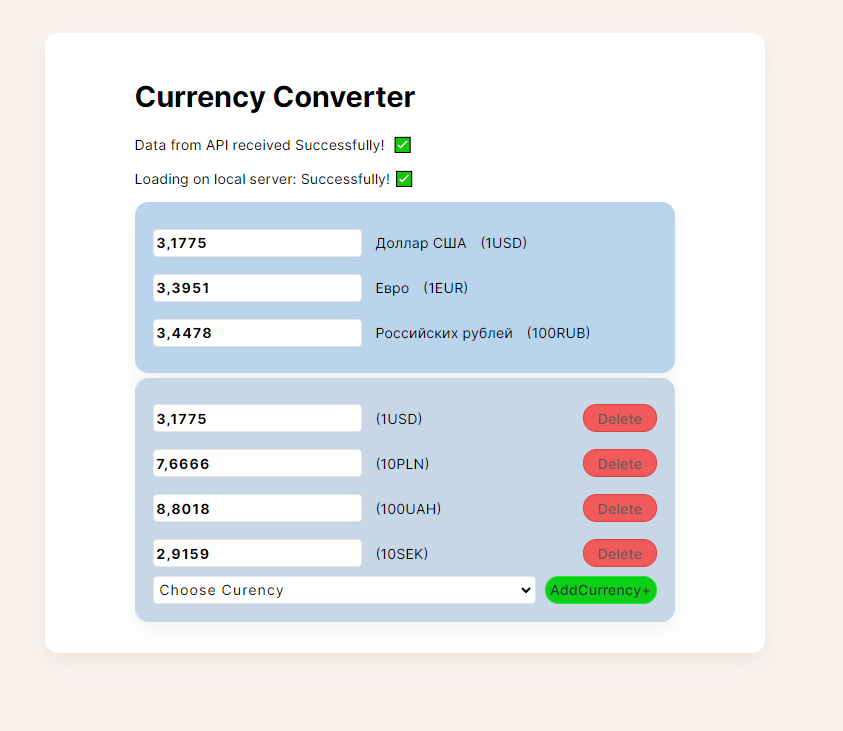
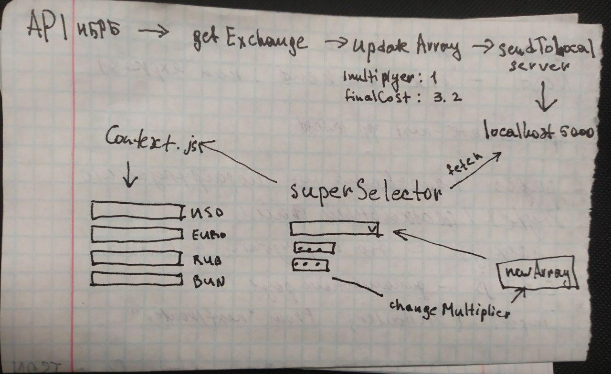

# converter
react+Node.js currency converter (use localhost 5000)

*git clone https://github.com/StanislavM31/converter.git*

# currency-converter
Preview^ Клиент-серверное приложение для конвертации валют.
Сервер разработан с помощью Node.js,
запиь курсов валют с API НБРБ происходит в './storage/storage.json'
далее вся работа с курсами валют происходит при взаимодействии с этим файлом.

- 0. VisualStudio:
    в одном терминале зайти в директори server npm i -> nodemon index (должно быть    сообщение server is running on 5000)
    во втором терминале зайти в директорию client npm i -> npm start (должно быть    сообщение Compiled successfully!

You can now view converter in the browser.

  Local:            <http://localhost:3000>
  On Your Network:  <http://192.168.0.101:3000>

Note that the development build is not optimized.
To create a production build, use npm run build.

webpack compiled successfully)

- 1. GetDataFromAPI.jsx: получение данных с API
(5 попыток получения данных с сервера)
attemps = "goOn" => идем дальше.
получил массив данных с API
- 2. UpdateDataAPI.js
Дописал 2 литерала к элементам массива(multiplier,finalCost)
- 3. SendToServerUpdatedDataAPI.jsx - отправка на локал сервер
- 4. SuperCurrencySelector.jsx - выпадающий список можно добавлять валюту
  - 4.1. для отрисовки инпутов используется CurrencyBlock.jsx
  - 4.2. в добавленых инпутах можно менять значения. Курсы валют пересчитываются
  - 4.3. акутальный (в случае изменения Multiplier) массив arrayOfCuзаписывается в контекст
- 5. StaticCurrencyConverter.jsx - рендер статичных полей, значения берет из массива. readOnly
- 5. ипуты в StaticCurrencyConverter.jsx readOnly, но тем не менее,
эти валюты можно добавить в выпадающем списке и в них менять значение
(будет дублирование статичных полей, но добавленные будут изменяемые) т.о. можно менять значения в статичных полях

*сделал кастомный хук useDebaunce (работал на статичном массиве без сервера. Пока пришлось удалить логику работы)
